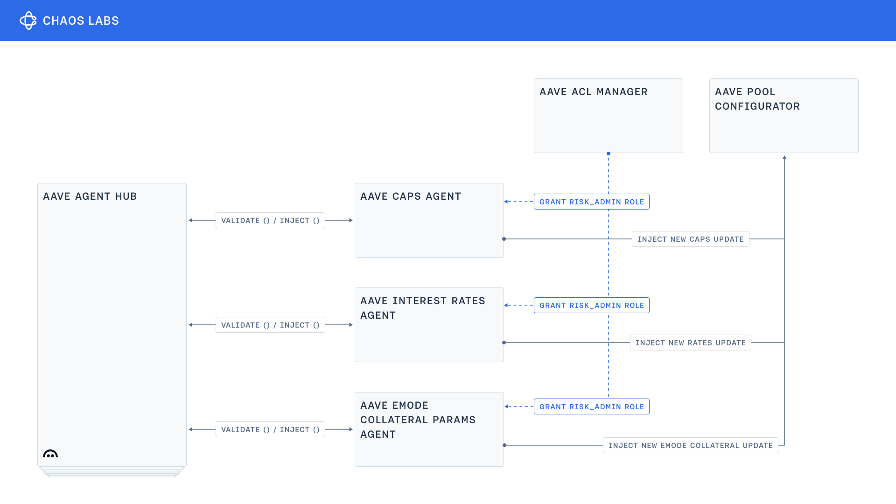

# Aave Risk Agents

Aave-specific agent contracts for automated risk parameter updates via the [Chaos Agents](https://github.com/ChaosLabsInc/chaos-agents) middleware.

## About

This repository contains lightweight agent contracts that validate and inject automated risk parameter updates from the Chaos Risk Oracle into Aave protocol. Each agent handles specific risk parameter types and includes Aave-specific validation logic.

The agents require `RISK_ADMIN` role granted by Aave governance and are controlled through a single Aave agent hub.

## System Architecture



The system operates through three components:

- **Chaos Risk Oracle** publishes automated risk parameter updates (caps, rates, ltv etc.) on-chain.
- **Chaos Agents middleware** pulls oracle payloads, runs protocol checks, forwards to agents.
- **Aave Risk Agents** validate payloads against Aave rules, execute protocol state changes.

## Contracts

This repository hosts the following Aave-specific agent implementations:

| Agent                   | Purpose                                                                 | Contract                                                                   |
| ----------------------- | ----------------------------------------------------------------------- | -------------------------------------------------------------------------- |
| **CAPO Agent**          | Validate/update CAPO feed parameters (snapshot ratio, maxGrowthPercent) | [AaveCapoAgent.sol](src/contracts/agent/AaveCapoAgent.sol)                 |
| **Supply Cap Agent**    | Validate/update supply caps for assets                                  | [AaveSupplyCapAgent.sol](src/contracts/agent/AaveSupplyCapAgent.sol)       |
| **Borrow Cap Agent**    | Validate/update borrow caps for assets                                  | [AaveBorrowCapAgent.sol](src/contracts/agent/AaveBorrowCapAgent.sol)       |
| **Discount Rate Agent** | Validate/update discount-rate on Pendle PT feeds                        | [AaveDiscountRateAgent.sol](src/contracts/agent/AaveDiscountRateAgent.sol) |
| **E-Mode Agent**        | Validate/update E-Mode category parameters                              | [AaveEModeAgent.sol](src/contracts/agent/AaveEModeAgent.sol)               |
| **Rates Agent**         | Validate/update interest rate strategy updates                          | [AaveRatesAgent.sol](src/contracts/agent/AaveRatesAgent.sol)               |

**Note**: These agents require the `RISK_ADMIN` role from Aave governance and must be controlled by a single Aave agent hub.

## Setup

### Prerequisites

- [Foundry](https://getfoundry.sh/)

### Installation

```bash
forge install
```

### Build

```bash
forge build
```

### Test

```bash
forge test
```

## Related documentation

- [Chaos Agents middleware](https://github.com/ChaosLabsInc/chaos-agents)

## License

This project is released under the [MIT license](./LICENSE). Copyright © 2025 BGD Labs.
